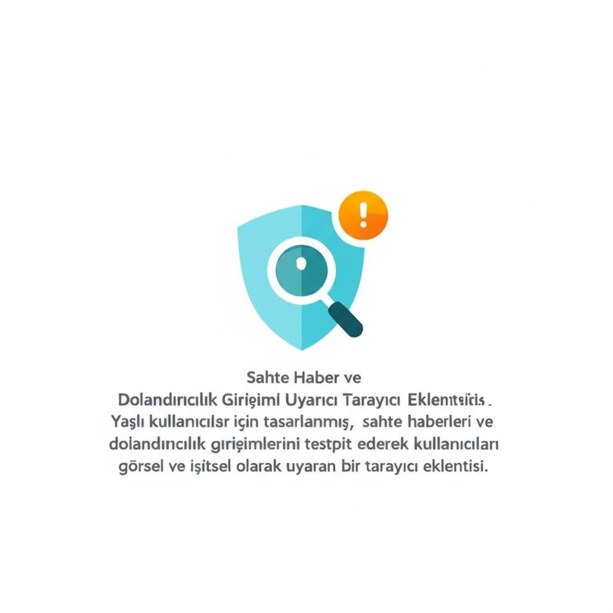

# Sahte Haber ve Dolandırıcılık Girişimi Uyarıcı Tarayıcı Eklentisi

## Proje Tanımı
Bu proje, özellikle yaşlı kullanıcılar için tasarlanmış bir tarayıcı eklentisidir. Eklenti, ziyaret edilen web sitelerindeki sahte haberleri ve dolandırıcılık girişimlerini tespit ederek kullanıcıları görsel ve işitsel olarak uyarır. Amaç, savunmasız kullanıcıları çevrimiçi tehditlerden korumak ve daha güvenli bir internet deneyimi sunmaktır.

## Temel Özellikler
- Gerçek Zamanlı Analiz: Ziyaret edilen web sayfalarının içeriğini gerçek zamanlı olarak analiz ederek sahte haber ve dolandırıcılık belirtilerini tespit etme.
- Görsel Uyarılar: Şüpheli içerik tespit edildiğinde kullanıcıyı uyaran belirgin görsel uyarılar.
- İşitsel Uyarılar: Görsel uyarılara ek olarak, kullanıcının dikkatini çekmek için işitsel uyarılar.
- Güvenilirlik Derecelendirmesi: Web sitelerine ve haber kaynaklarına güvenilirlik derecelendirmesi atama ve gösterme.
- Kullanıcı Tarafından Bildirme: Kullanıcıların şüpheli içerikleri manuel olarak bildirmesi.
- Özelleştirilebilir Ayarlar: Uyarı hassasiyeti, görsel ve işitsel uyarı tercihleri gibi kullanıcı tarafından özelleştirilebilir ayarlar.
- Veritabanı Güncellemesi: Sahte haber ve dolandırıcılık örneklerini içeren veritabanını düzenli olarak güncelleme.
- Gizlilik Odaklı Tasarım: Kullanıcı verilerinin gizliliğini koruma ve minimum veri toplama.

## Önerilen Teknoloji Yığını
- Frontend: Next.js, React, ShadCN UI, Tailwind CSS
- Backend (gerekirse): Next.js API Routes
- Veritabanı: Firebase Firestore
- AI Özellikleri: Genkit (sahte haber ve dolandırıcılık tespiti)
- Tarayıcı Eklentisi: Chrome Extension API (veya benzeri)

## Anahtar Bileşenler
- UyarıPaneli: Sahte haber veya dolandırıcılık tespit edildiğinde beliren uyarıları gösterir.
- GüvenilirlikGöstergesi: Web sitesinin güvenilirlik derecesini gösterir.
- AyarlarPaneli: Eklenti ayarlarını özelleştirmeyi sağlar.
- BildirimFormu: Şüpheli içeriklerin bildirilmesini sağlar.
- ArkaPlanServisi: Gerçek zamanlı analiz ve veritabanı güncellemelerini yürütür.

## Kullanıcı Deneyimi (UX) Hususları
- Basit ve sezgisel arayüz; büyük ve okunabilir yazı tipleri.
- Net ve eyleme dönük uyarılar.
- Erişilebilirlik (renk körlüğü vb. için uygun kontrast ve ARIA).
- Performans: Hızlı ve düşük kaynak tüketimi.

## Gizlilik ve Güvenlik
- Gizlilik odaklı tasarım, minimum veri toplama.
- Toplanan verilerin güvenli saklanması ve yetkisiz erişime karşı korunması.

## Dokümantasyon
- Gereksinimler: [docs/requirements.md](docs/requirements.md)
- Tasarım: [docs/design.md](docs/design.md)
- Görevler/Yol Haritası: [docs/tasks.md](docs/tasks.md)

## Durum
Bu repo şu an fikir ve dokümantasyon aşamasındadır. Uygulama planı ve görev listesi için [docs/tasks.md](docs/tasks.md) dosyasına bakınız.
