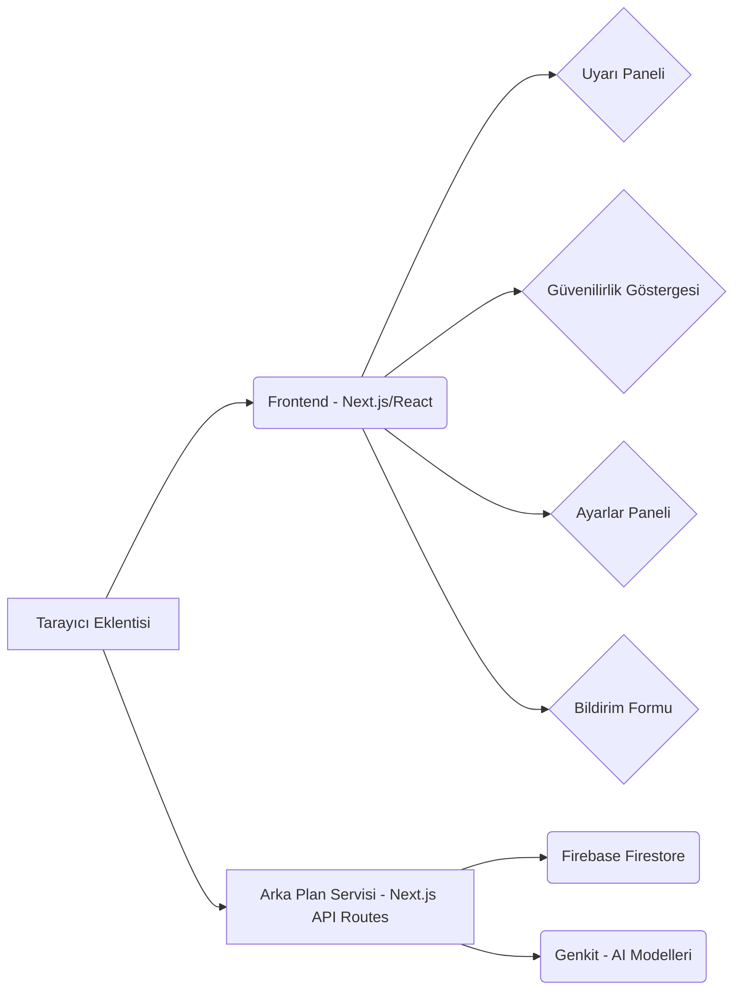

# Tasarım Dokümanı

## Genel Bakış
Bu doküman, Sahte Haber ve Dolandırıcılık Girişimi Uyarıcı Tarayıcı Eklentisi'nin teknik tasarımını açıklar. Tasarım, modüler ve ölçeklenebilir bir yaklaşıma dayanır.

## Mimari



## Çekirdek Bileşenler
1. UyarıPaneli: Şüpheli içerik tespitinde uyarıları gösterir.
1. GüvenilirlikGöstergesi: Sitenin güvenilirlik derecesini gösterir.
1. AyarlarPaneli: Kullanıcı ayarlarını özelleştirir.
1. BildirimFormu: Şüpheli içerik bildirimini sağlar.
1. ArkaPlanServisi: Analiz ve veritabanı güncellemelerini yürütür.

## Veri Modelleri
```typescript
interface SahteHaber {
  url: string;
  baslik: string;
  aciklama: string;
  kaynak: string;
  eklenmeTarihi: Date;
}

interface DolandiricilikGirisimi {
  url: string;
  baslik: string;
  aciklama: string;
  tur: string;
  eklenmeTarihi: Date;
}

interface KullaniciBildirimi {
  url: string;
  kullaniciId: string;
  aciklama: string;
  bildirimTarihi: Date;
}
```

## Güvenlik Hususları
- Kullanıcı verileri şifrelenmeli ve yetkisiz erişime karşı korunmalıdır.
- Kimlik doğrulama güvenli şekilde yapılmalı, hassas veriler korunmalıdır.
- Düzenli güvenlik açığı taramaları yapılmalıdır.
