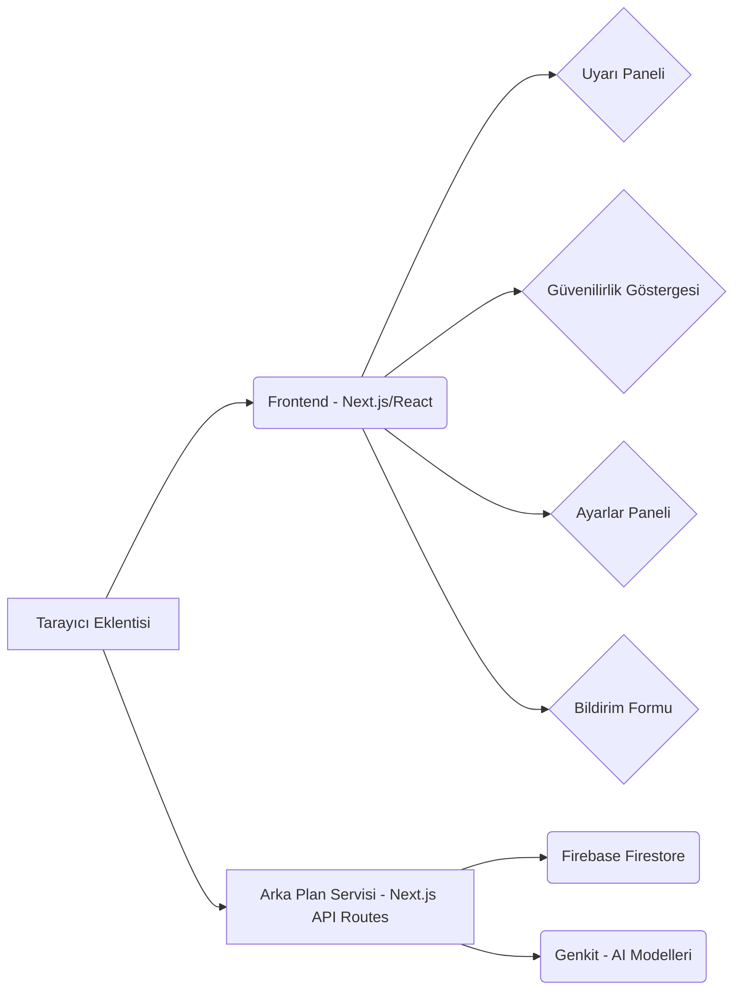

# Idea Generator Export

## 💡 Önerilen Fikir

**Sahte Haber ve Dolandırıcılık Girişimi Uyarıcı Tarayıcı Eklentisi: Yaşlı kullanıcılar için tasarlanmış, sahte haberleri ve dolandırıcılık girişimlerini tespit ederek kullanıcıları görsel ve işitsel olarak uyaran bir tarayıcı eklentisi.**

Yaşlılar genellikle internetteki sahte haberlere ve dolandırıcılık girişimlerine karşı daha savunmasızdırlar. Bu eklenti, basit ve anlaşılır bir arayüzle bu sorunlara karşı onları koruyarak, interneti daha güvenli bir şekilde kullanmalarını sağlar. Tarayıcı eklentisi olması, kullanım kolaylığı sağlar ve sürekli olarak arka planda çalışarak kullanıcıları bilgilendirir. Görsel ve işitsel uyarılar, farkındalığı artırır ve potansiyel tehlikelere karşı dikkatlerini çeker.

---

## 🚀 Oluşturulan Geliştirici Prompt'u

## Proje Tanımı: Sahte Haber ve Dolandırıcılık Girişimi Uyarıcı Tarayıcı Eklentisi

Bu proje, özellikle yaşlı kullanıcılar için tasarlanmış bir tarayıcı eklentisidir. Eklenti, ziyaret edilen web sitelerindeki sahte haberleri ve dolandırıcılık girişimlerini tespit ederek kullanıcıları görsel ve işitsel olarak uyarır. Amaç, savunmasız kullanıcıları çevrimiçi tehditlerden korumak ve daha güvenli bir internet deneyimi sunmaktır.

## Temel Özellikler:

*   **Gerçek Zamanlı Analiz:** Ziyaret edilen web sayfalarının içeriğini gerçek zamanlı olarak analiz ederek sahte haber ve dolandırıcılık belirtilerini tespit etme.
*   **Görsel Uyarılar:** Şüpheli içerik tespit edildiğinde kullanıcıyı uyaran belirgin görsel uyarılar (örneğin, sayfa üzerinde beliren bir uyarı mesajı veya simge).
*   **İşitsel Uyarılar:** Görsel uyarılara ek olarak, kullanıcının dikkatini çekmek için işitsel uyarılar (örneğin, bir uyarı sesi).
*   **Güvenilirlik Derecelendirmesi:** Web sitelerine ve haber kaynaklarına güvenilirlik derecelendirmesi atama ve bunları kullanıcılara gösterme.
*   **Kullanıcı Tarafından Bildirme:** Kullanıcıların şüpheli içerikleri manuel olarak bildirme imkanı.
*   **Özelleştirilebilir Ayarlar:** Uyarı hassasiyeti, görsel ve işitsel uyarı tercihleri gibi kullanıcı tarafından özelleştirilebilir ayarlar.
*   **Veritabanı Güncellemesi:** Sahte haber ve dolandırıcılık örneklerini içeren veritabanını düzenli olarak güncelleme.
*   **Gizlilik Odaklı Tasarım:** Kullanıcı verilerinin gizliliğini koruma ve minimum veri toplama.

## Önerilen Teknoloji Yığını:

*   **Frontend:** Next.js (sunucu tarafı render ve performans için), React (bileşen tabanlı geliştirme), ShadCN UI (kullanıcı arayüzü bileşenleri), Tailwind CSS (stil verme).
*   **Backend (Eğer gerekliyse):** Next.js API routes
*   **Veritabanı:** Firebase Firestore (gerçek zamanlı veri senkronizasyonu ve kolay entegrasyon için).
*   **AI Özellikleri:** Genkit (sahte haber ve dolandırıcılık tespiti için yapay zeka modellerini entegre etmek).
*   **Tarayıcı Eklentisi Geliştirme:** Chrome Extension API veya benzeri (tarayıcıya entegre etmek için).

## Anahtar Bileşenler:

*   **UyarıPaneli:** Sahte haber veya dolandırıcılık tespit edildiğinde beliren uyarıları gösteren React bileşeni.
*   **GüvenilirlikGöstergesi:** Web sitesinin güvenilirlik derecesini gösteren React bileşeni.
*   **AyarlarPaneli:** Kullanıcının eklenti ayarlarını özelleştirmesini sağlayan React bileşeni.
*   **BildirimFormu:** Kullanıcının şüpheli içerikleri bildirmesini sağlayan React bileşeni.
*   **ArkaPlanServisi:** Gerçek zamanlı analiz ve veritabanı güncellemelerini yapan arka plan servisi (Next.js API routes veya ayrı bir Node.js servisi).

## Veri Modeli (Firebase Firestore için örnek):

*   **collections:**
    *   **sahteHaberler:**
        *   **alanlar:** `url` (string), `baslik` (string), `aciklama` (string), `kaynak` (string), `eklenmeTarihi` (timestamp)
    *   **dolandiricilikGirisimleri:**
        *   **alanlar:** `url` (string), `baslik` (string), `aciklama` (string), `tur` (string), `eklenmeTarihi` (timestamp)
    *   **kullaniciBildirimleri:**
        *   **alanlar:** `url` (string), `kullaniciId` (string), `aciklama` (string), `bildirimTarihi` (timestamp)

## Kullanıcı Deneyimi (UX) Hususları:

*   **Basit ve Sezgisel Arayüz:** Yaşlı kullanıcıların kolayca anlayabileceği ve kullanabileceği bir arayüz tasarlayın.
*   **Okunabilirlik:** Büyük ve okunabilir yazı tipleri kullanın.
*   **Net Uyarılar:** Uyarı mesajları açık, anlaşılır ve eyleme yönelik olmalıdır.
*   **Erişilebilirlik:** Renk körlüğü gibi erişilebilirlik sorunlarını göz önünde bulundurun.
*   **Performans:** Eklentinin performansı hızlı ve kaynak tüketimi düşük olmalıdır.

---

# Requirements Document

## Introduction

Bu belge, Sahte Haber ve Dolandırıcılık Girişimi Uyarıcı Tarayıcı Eklentisi projesi için gereksinimleri detaylandırmaktadır. Projenin amacı, özellikle yaşlı kullanıcıları çevrimiçi sahte haberlerden ve dolandırıcılık girişimlerinden korumaktır.

## Requirements

### Requirement 1: Gerçek Zamanlı Analiz

**User Story:** Bir kullanıcı olarak, ziyaret ettiğim web sayfalarının gerçek zamanlı olarak analiz edilmesini istiyorum, böylece sahte haber ve dolandırıcılık girişimlerinden haberdar olayım.

#### Acceptance Criteria

1. WHEN kullanıcı bir web sayfasını ziyaret eder, THEN eklenti sayfa içeriğini otomatik olarak analiz etmelidir.
1. WHEN sahte haber veya dolandırıcılık belirtileri tespit edilirse, THEN sistem uyarı vermelidir.
1. WHEN analiz tamamlanırsa, THEN kullanıcının performansı etkilenmemelidir.

### Requirement 2: Görsel Uyarılar

**User Story:** Bir kullanıcı olarak, şüpheli içerik tespit edildiğinde belirgin görsel uyarılar görmek istiyorum, böylece dikkatimi çeksin ve tehlikeden haberdar olayım.

#### Acceptance Criteria

1. WHEN şüpheli içerik tespit edilirse, THEN sayfa üzerinde belirgin bir uyarı mesajı veya simge belirmelidir.
1. WHEN görsel uyarı görüntülenirse, THEN kullanıcı uyarıyı kolayca fark etmelidir.
1. WHEN uyarı mesajı görüntülenirse, THEN mesaj açık ve anlaşılır olmalıdır.

### Requirement 3: İşitsel Uyarılar

**User Story:** Bir kullanıcı olarak, görsel uyarılara ek olarak işitsel uyarılar duymak istiyorum, böylece dikkatimi daha da çeksin ve tehlikeden haberdar olayım.

#### Acceptance Criteria

1. WHEN şüpheli içerik tespit edilirse, THEN görsel uyarılara ek olarak bir uyarı sesi çalınmalıdır.
1. WHEN uyarı sesi çalarsa, THEN ses yüksek ve belirgin olmalıdır.
1. WHEN uyarı sesi çalarsa, THEN kullanıcı sesin ne anlama geldiğini bilmelidir.

### Requirement 4: Güvenilirlik Derecelendirmesi

**User Story:** Bir kullanıcı olarak, web sitelerinin ve haber kaynaklarının güvenilirlik derecelendirmesini görmek istiyorum, böylece hangi kaynaklara güvenebileceğimi bileyim.

#### Acceptance Criteria

1. WHEN kullanıcı bir web sitesini ziyaret ederse, THEN eklenti sitenin güvenilirlik derecesini göstermelidir.
1. WHEN bir haber kaynağı görüntülenirse, THEN haber kaynağının güvenilirlik derecesi gösterilmelidir.
1. WHEN güvenilirlik derecesi görüntülenirse, THEN derecelendirme kaynağı belirtilmelidir.

### Requirement 5: Kullanıcı Tarafından Bildirme

**User Story:** Bir kullanıcı olarak, şüpheli içerikleri manuel olarak bildirebilmek istiyorum, böylece diğer kullanıcıları da koruyabileyim.

#### Acceptance Criteria

1. WHEN kullanıcı şüpheli bir içerik görürse, THEN içeriği bildirme seçeneği sunulmalıdır.
1. WHEN kullanıcı bir içerik bildirirse, THEN bildirim sistemi tarafından alınmalı ve kaydedilmelidir.
1. WHEN bir içerik bildirildikten sonra, THEN yetkililer bildirimi incelemelidir.

### Requirement 6: Özelleştirilebilir Ayarlar

**User Story:** Bir kullanıcı olarak, uyarı hassasiyeti, görsel ve işitsel uyarı tercihleri gibi ayarları özelleştirebilmek istiyorum, böylece eklentiyi kendi ihtiyaçlarıma göre ayarlayabileyim.

#### Acceptance Criteria

1. WHEN kullanıcı ayarlar paneline erişirse, THEN uyarı hassasiyetini ayarlayabilmelidir.
1. WHEN kullanıcı ayarlar paneline erişirse, THEN görsel ve işitsel uyarı tercihlerini değiştirebilmelidir.
1. WHEN kullanıcı ayarları kaydederse, THEN ayarlar uygulanmalıdır.

### Requirement 7: Veritabanı Güncellemesi

**User Story:** Bir kullanıcı olarak, sahte haber ve dolandırıcılık örneklerini içeren veritabanının düzenli olarak güncellendiğinden emin olmak istiyorum, böylece eklenti güncel tehditlere karşı etkili olsun.

#### Acceptance Criteria

1. WHEN yeni sahte haberler veya dolandırıcılık girişimleri tespit edilirse, THEN veritabanı güncellenmelidir.
1. WHEN veritabanı güncellenirse, THEN eklenti yeni tehditleri tanımalıdır.
1. WHEN veritabanı güncellenirse, THEN performans etkilenmemelidir.

### Requirement 8: Gizlilik Odaklı Tasarım

**User Story:** Bir kullanıcı olarak, verilerimin gizliliğinin korunduğundan ve minimum veri toplandığından emin olmak istiyorum, böylece gizliliğime saygı duyulsun.

#### Acceptance Criteria

1. WHEN eklenti çalışırsa, THEN minimum veri toplanmalıdır.
1. WHEN veri toplanırsa, THEN veri güvenli bir şekilde saklanmalıdır.
1. WHEN kullanıcı verileri talep ederse, THEN kullanıcıya verileri verilmelidir.


---

# Design Document

## Overview

Bu bölüm, Sahte Haber ve Dolandırıcılık Girişimi Uyarıcı Tarayıcı Eklentisi'nin teknik tasarımını açıklamaktadır. Tasarım, modüler bir yaklaşıma dayanmakta ve ölçeklenebilirlik ve sürdürülebilirlik göz önünde bulundurulmaktadır.

## Architecture

### High-Level Architecture


```

### Core Components

1. **UyarıPaneli**: Sahte haber veya dolandırıcılık tespit edildiğinde beliren uyarıları gösteren React bileşeni.
1. **GüvenilirlikGöstergesi**: Web sitesinin güvenilirlik derecesini gösteren React bileşeni.
1. **AyarlarPaneli**: Kullanıcının eklenti ayarlarını özelleştirmesini sağlayan React bileşeni.
1. **BildirimFormu**: Kullanıcının şüpheli içerikleri bildirmesini sağlayan React bileşeni.
1. **ArkaPlanServisi**: Gerçek zamanlı analiz ve veritabanı güncellemelerini yapan arka plan servisi (Next.js API routes veya ayrı bir Node.js servisi).

## Data Models

```typescript
```typescript
interface SahteHaber {
 url: string;
 baslik: string;
 aciklama: string;
 kaynak: string;
 eklenmeTarihi: Date;
}

interface DolandiricilikGirisimi {
 url: string;
 baslik: string;
 aciklama: string;
 tur: string;
 eklenmeTarihi: Date;
}

interface KullaniciBildirimi {
 url: string;
 kullaniciId: string;
 aciklama: string;
 bildirimTarihi: Date;
}
```
```

## Security Considerations

Güvenlik hususları arasında, kullanıcı verilerinin şifrelenmesi, yetkisiz erişimin önlenmesi ve düzenli güvenlik açığı taramaları yer almaktadır. Kullanıcı kimlik doğrulaması güvenli bir şekilde yapılmalı ve hassas veriler korunmalıdır.


---

# Implementation Plan

- [ ] Next.js projesi oluştur ve temel bileşenleri kur.
- [ ] Firebase Firestore'u projeye entegre et.
- [ ] SahteHaberler, DolandiricilikGirisimleri ve KullaniciBildirimleri koleksiyonlarını Firebase'de oluştur.
- [ ] UyarıPaneli React bileşenini geliştir.
  - _Requirements: Görsel Uyarılar, İşitsel Uyarılar_
- [ ] GüvenilirlikGöstergesi React bileşenini geliştir.
  - _Requirements: Güvenilirlik Derecelendirmesi_
- [ ] AyarlarPaneli React bileşenini geliştir.
  - _Requirements: Özelleştirilebilir Ayarlar_
- [ ] BildirimFormu React bileşenini geliştir.
  - _Requirements: Kullanıcı Tarafından Bildirme_
- [ ] ArkaPlanServisi'ni (Next.js API routes kullanarak) geliştir.
  - _Requirements: Gerçek Zamanlı Analiz, Veritabanı Güncellemesi_
- [ ] Genkit'i entegre ederek AI modellerini sahte haber ve dolandırıcılık tespiti için kullan.
  - _Requirements: Gerçek Zamanlı Analiz_
- [ ] Chrome Extension API veya benzeri bir API kullanarak tarayıcı eklentisini geliştir.
- [ ] Kullanıcı arayüzünü (ShadCN UI ve Tailwind CSS kullanarak) tasarla ve geliştir.
  - _Requirements: Basit ve Sezgisel Arayüz, Okunabilirlik, Net Uyarılar, Erişilebilirlik_
- [ ] Eklentinin performansını optimize et.
  - _Requirements: Performans_
- [ ] Eklentiyi test et ve hataları gider.
- [ ] Eklentiyi yayınla.